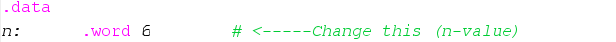
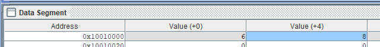

# Project 2 Progress Report (Final Report)

**Date:** 04/02/2025  
**Team Members:**

- Devarsh Gandhi (650681648)
- Jalen Davis (674886087)
- Andrei Aquino (655230892)

**GitHub Repository:**  
[Project 2 Repository](https://github.com/devy03/ECE-366-Projects)

---

## How to Run the Simulation

- Change **line 2** of the `.asm` file to the desired value of `n` to run `Fibonacci(n)`.

---

## Where is the Result?

- Go to the **Data Segment** tab
- Look for memory address `0x10010000`
  - **Value(+0)** = `n`
  - **Value(+4)** = `Fibonacci(n)`
  - **Value(+8)** = `isFibOdd(n)` 1-Odd 0-Even

---

## Team Member Responsibilities

- **Devarsh Gandhi (34%)**  
  Collaboratively wrote the code for `Fibonacci(n)`. Combined `isOdd(m)` logic written by the group and added it to `Fibonacci(n)` code. Created `Readme.md`

- **Jalen Davis (33%)**  
  Collaborated with Drei and Devarsh on the starting code and provided input on the Fibonacci implementation. [edit here]

- **Andrei Aquino (33%)**  
  Collaboratively wrote the code for `Fibonacci(n)`. [add here]
