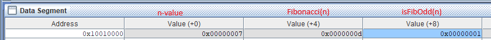

Project 2 Progress Report (1)

Date: 04/02/2025
Team Members: Devarsh Gandhi (650681648), Jalen Davis ( 674886087), Andrei Aquino (655230892)
GitHub Repository: 

How to run the sim?
- change line 2 of the asm file to whatever value of n to run Fibonacci(n)

Where is the result?
- go to Data Segment tab >> look for memory address 0x10010000>> Value(+0) is n and Value(+4) is the result. 

Team Member Responsibilities:
Devarsh Gandhi: (33%) collaboratively wrote the code for the fibonacci(n) and make readme file

Jalen Davis:(33%) collaborate both Drei and Devarsh about the starting code and help give input on the starting code Fibonacci 

Andrei Aquino: (34%) responsible for collaboratively writing the code for fibonacci(n) 
